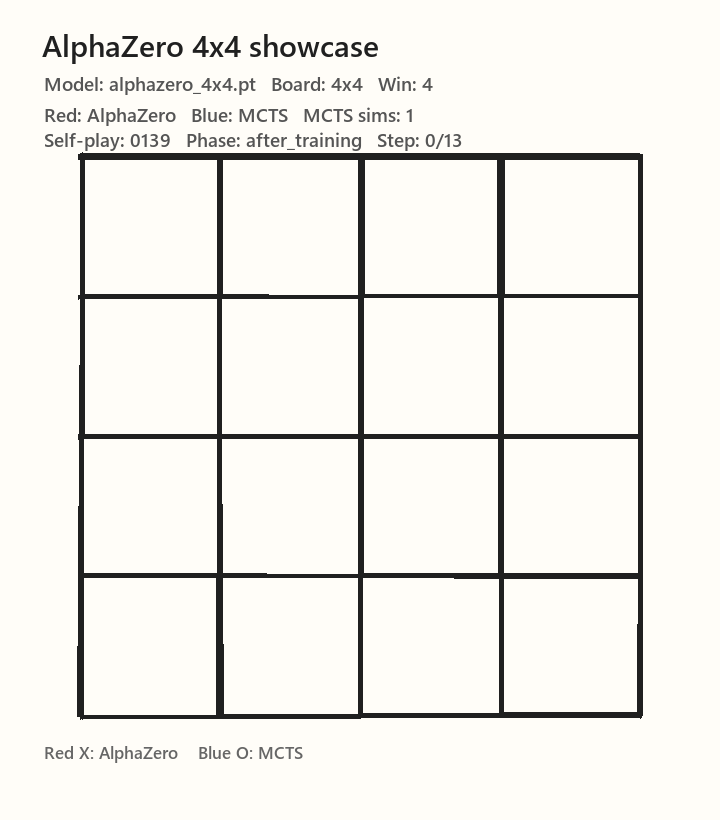
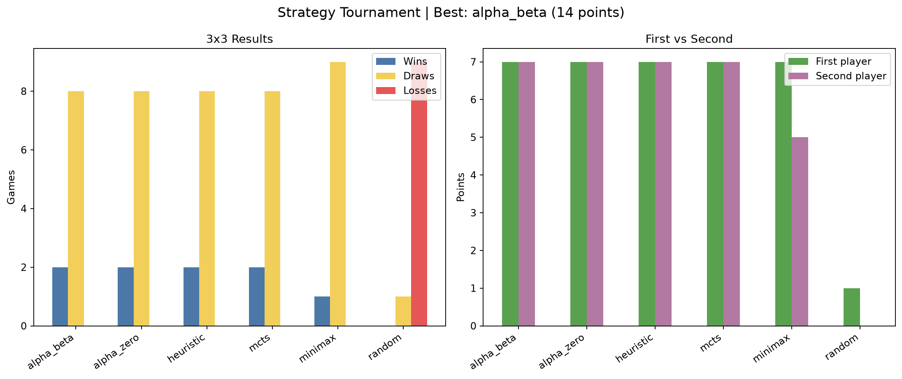
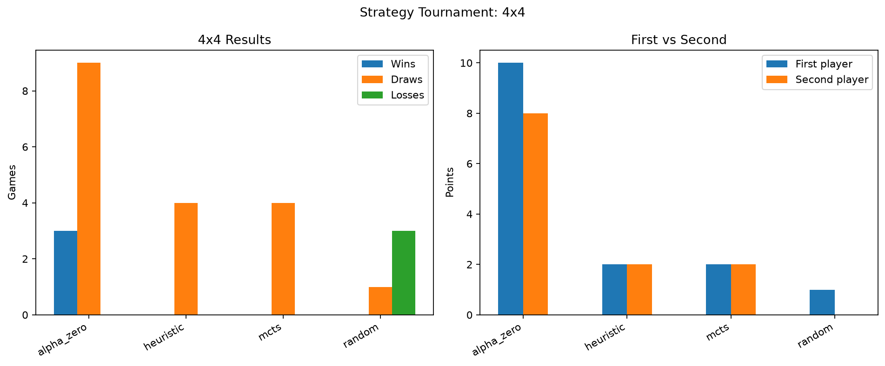
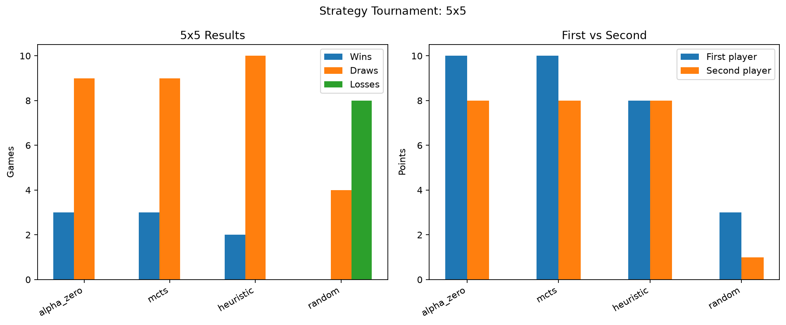
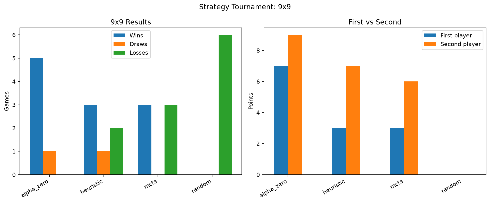
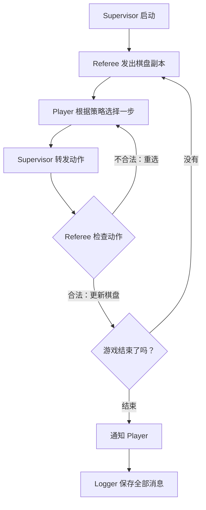

# Qizhi Agent

Qizhi Agent（棋智 Agent）是一个多智能体棋类实验项目，安装包和窗口标题也采用这个名称。

这是一个用 Python 写的多智能体棋类实验项目。井字棋覆盖 3×3、4×4、5×5 和 9×9，另外提供五子棋、9×9 围棋和中国象棋。项目把多进程通信、角色分工、策略替换、训练记录、对局评测和图形界面放在同一个可以直接运行的工程里；棋盘规则、AI 决策和界面彼此独立，方便替换策略和扩展棋类。
井字棋支持随机、启发式、Minimax、Alpha-Beta、MCTS，以及 policy/value 网络配合神经 MCTS 的 AlphaZero 推理和自我对弈训练。围棋与中国象棋在 GUI 中接入了各自原生协议的强引擎：KataGo 使用 9×9 网络，Pikafish 使用 NNUE。它们不是把不同格式的权重改名成 `.pt`，而是通过 GTP/UCI 适配层调用，所以模型确实参与了落子。所有棋类都支持人机对战和 AI 对战；缺少外部运行包时，界面会明确显示 AI 不可用，而不会静默给出一手假棋。

<p align="center">
  
  
  
</p>

三张 GIF 使用同一个 4×4 棋盘和同一个 MCTS 对手：训练早期输棋，中期守成打平，晚期找到胜法。红色棋子是 AlphaZero，蓝色棋子是 MCTS；画面中的 self-play 数量、搜索次数和 step 来自对应的对局日志。

## 各尺寸策略对战结果

`evaluation/figures/` 中的四张图分别对应 3×3、4×4、5×5 和 9×9，展示各策略的胜负以及先手、后手得分。3×3 的 `alpha_zero` 使用项目自己训练的最佳模型。

<table>
  <tr>
    <td></td>
    <td></td>
  </tr>
  <tr>
    <td></td>
    <td></td>
  </tr>
</table>

## 项目结构

```text
tictactoe/
├── environment.py              # 棋盘、合法动作、胜负判断和文本渲染
├── main.py                     # 基础多智能体版本：启发式 X 对随机 O
├── minmax.py                   # Minimax 版本、测试和可配置策略对战入口
├── strategies.py               # Alpha-Beta、MCTS 和 AlphaZero 策略
├── alphazero_adapter.py        # 3×3 模型的 PyTorch 推理适配器
├── board_environment.py        # 可配置尺寸和连线长度的棋盘规则
├── alphazero_core.py           # policy/value 网络和神经 MCTS
├── scripts/                    # 训练、评测、可视化和环境脚本
│   ├── alphazero_train.py      # 自我对弈训练入口
│   ├── tournament.py            # 3×3 策略对战
│   ├── multiboard_tournament.py # 多尺寸策略评测
│   ├── select_alphazero.py     # 按训练 loss 挑选最佳 checkpoint
│   ├── make_progression_showcase.py # 生成早中晚阶段日志
│   ├── make_alphazero_gif.py   # 逐帧绘制训练 GIF
│   ├── make_model_summary.py   # 绘制训练和 tournament 汇总图
│   ├── setup_env.ps1           # Windows 自动配置
│   └── setup_env.sh            # Linux/ARM64 自动配置
├── upgrade.py                   # Pygame 图形界面启动入口
├── gui/                         # 图形界面模块
│   ├── app.py                   # 页面切换、配置页和游戏页
│   ├── theme.py                 # 配色、字体和通用控件
│   ├── tictactoe.py             # 井字棋界面和策略调用
│   ├── other_games.py           # 五子棋、围棋、中国象棋及规则控制
│   └── engine_adapters.py       # KataGo GTP 和 Pikafish UCI 适配层
├── engines/                     # KataGo、Pikafish 运行文件
└── models/
    ├── alphazero/               # 各尺寸最佳模型
    │   ├── alphazero_3x3_best.pt
    │   ├── alphazero_4x4_best.pt
    │   ├── alphazero_5x5_best.pt
    │   └── alphazero_9x9_best.pt
    └── go/                      # KataGo 9x9 network
```

`engines/` 中的 Windows runtime 和 `models/go/` 中的 9×9 网络已经随仓库提供，clone 后不需要再手动改路径。KataGo 运行包来自其官方发布页，Pikafish 运行包来自官方发布页；两个目录内保留对应的许可和说明文件。Windows 下程序会自动优先使用本项目目录中的 KataGo CUDA runtime 和 Pikafish AVX2 executable，显卡或运行库不满足时，界面会显示具体的不可用状态。

一局游戏由四类进程组成：`Referee`、`Player X`、`Player O` 和 `Logger`。Player 只根据收到的棋盘副本提出动作，Referee 检查动作是否合法、更新正式棋盘并决定游戏是否结束。所有消息经过统一的字典结构传递，日志使用 JSON Lines 格式保存，方便后续统计非法动作、动作数量、胜负和通信顺序。

## Agent 策略

| 策略名 | 实现位置 | 特点 | 适合用来做什么 |
| --- | --- | --- | --- |
| `random` | `main.py` | 从合法位置随机选一步 | 作为基线，制造一点不可预测性 |
| `heuristic` | `main.py` | 按立即获胜、立即防守、中心、角落、边的顺序选点 | 轻量基线，速度很快 |
| `minimax` | `minmax.py` | 穷举后续状态，使用胜负分数选择最优动作 | 3×3 棋盘上的确定性强基线 |
| `alpha_beta` | `strategies.py` | Minimax 加 Alpha-Beta 剪枝 | 和 Minimax 结果相近，搜索更利落 |
| `mcts` | `strategies.py` | 使用 UCT 进行随机模拟和树搜索 | 观察搜索预算对决策的影响 |
| `alpha_zero` | `alphazero_core.py` | 使用 policy/value 网络引导神经 MCTS，并优先处理一步必胜或必防 | 比较自我对弈模型和经典搜索策略 |

`alpha_zero` 会根据棋盘尺寸加载对应的 checkpoint，使用 policy/value 网络引导 MCTS，再由搜索结果决定动作。训练入口会自己生成棋盘状态、搜索分布和最终胜负标签，不需要另外准备动作数据集；模型文件暂时不可用时，策略入口会回退到兼容推理或普通 MCTS。

围棋和中国象棋使用独立的原生引擎接口。KataGo 的网络文件放在 `models/go/`，Pikafish 的 NNUE 文件随引擎放在 `engines/pikafish/`，运行资源已经随公开仓库提供。GUI 的 AI vs AI 模式会让两边轮流向同一个引擎请求着法，并把引擎结果重新写入当前棋盘，因而也能用于演示和测试。
围棋控制器按 9×9 中国规则处理落子、提子、自杀禁着、全局劫、停着和连续两次停着终局，并在终局按子数、领地和 7.5 贴目显示结果。AI 被设置为不投降，必须通过合法落子或停着结束并算目。象棋控制器会记录局面重复和无吃子回合：同一局面第三次出现，或连续 120 个半回合没有吃子，都会判和，AI vs AI 也适用。象棋河界为完整空白带，竖线不会穿过楚河汉界。

最近一次完整 9×9 AI vs AI 检查共进行 69 步，最终有 52 个棋子，双方连续停着后完成计分，结果为 `Black 43.0 · White 45.5`，没有以投降提前结束。

## 完整 AlphaZero 训练

训练数据由自我对弈产生。每个局面会保存当前玩家视角的棋盘、MCTS 访问次数形成的 policy target，以及最终胜负形成的 value target；训练完成后，模型会保存到 `models/alphazero/`，回放数据保存到 `data/self_play/`，训练日志保存到 `logs/alphazero/`。

不同尺寸使用不同 checkpoint。3×3 使用三连，4×4 使用四连，5×5 和 9×9 使用五连。训练支持从已有 checkpoint 和 replay buffer 继续进行，每轮都会保存 candidate checkpoint，最后从训练日志中选取 loss 最低的一轮作为正式模型。下面这组命令适合先检查流程：

```bash
python -m scripts.alphazero_train --size 3 --iterations 10 --games-per-iteration 20 --simulations 50
python -m scripts.alphazero_train --size 4 --iterations 10 --games-per-iteration 16 --simulations 50
python -m scripts.alphazero_train --size 5 --iterations 10 --games-per-iteration 12 --simulations 50
python -m scripts.alphazero_train --size 9 --iterations 5 --games-per-iteration 4 --simulations 20 --epochs 5
```

如果要在已有 9×9 模型上继续做完整实验，可以把外层 iteration、self-play 对局和网络更新 epoch 一起提高。下面的命令会接着读取 `models/alphazero/alphazero_9x9_best.pt` 和 `data/self_play/9x9/`，训练日志会持续追加：

```bash
python -m scripts.alphazero_train --size 9 --iterations 30 --games-per-iteration 2 --simulations 10 --epochs 20 --resume
```

训练产物的目录约定如下：`models/alphazero/` 保存最终选出的最佳模型，`data/self_play/` 保存压缩回放池，`logs/alphazero/training_<size>x<size>.jsonl` 保存每轮 loss、样本量和 self-play 统计，`logs/alphazero/self_play/<size>x<size>/` 保存每盘逐步盘面、动作和 policy，后者可以直接拿来制作训练动画。训练期间产生的候选 checkpoint 可以留在本地，仓库只提交最终模型。

训练结束后，可以从训练日志里挑出 loss 最低的一轮，选中的文件会复制为正式 checkpoint；完整 tournament 只对这一个 checkpoint 运行，避免每轮都重复比赛：

```bash
python -m scripts.select_alphazero --size 4
python -m scripts.select_alphazero --size 5
python -m scripts.select_alphazero --size 9
```

9×9 是本项目的较大实验档，已经能体现动作空间和搜索深度的增长。100×100 可以改写成 benchmark，但完整 AlphaZero 训练需要面对 10,000 个动作位置和很长的对局，训练时间与显存开销都不适合放进这套作业实验。

训练结束后可以用对应尺寸的 tournament 做测试。每组策略默认进行两局，双方各先手一次：

```bash
python -m scripts.multiboard_tournament --size 4
python -m scripts.multiboard_tournament --size 5
python -m scripts.multiboard_tournament --size 9 --simulations 20
python -m scripts.multiboard_tournament --size 9 --focus-alpha-zero --alpha-simulations 30 --baseline-simulations 1 --games-per-pair 4
```

评测结果会保存到 `evaluation/results/multiboard_<size>x<size>.csv` 和 JSON 文件，图片保存到 `evaluation/figures/multiboard_<size>x<size>.png`，对局日志保存到 `logs/multiboard_tournament/<size>x<size>/`。排名采用胜局 3 分、和棋 1 分、负局 0 分，并把先手和后手分开统计。

`--focus-alpha-zero` 只跑 AlphaZero 对 `random`、`heuristic` 和 `mcts` 的定向对局，适合 9×9 这类搜索成本较高的尺寸；`--alpha-simulations` 和 `--baseline-simulations` 可以分别控制双方的搜索预算。3×3 的完美 Minimax 理论上不会输，AlphaZero 在这个尺寸的合理验收标准是保持不败；4×4、5×5 和 9×9 再观察实际胜负与结束步数。

## 训练结果与最佳模型

当前保留的最佳模型和最近一次 tournament 摘要如下。训练盘数按 `training_<size>x<size>.jsonl` 中已经记录的 self-play 盘数统计，模型选择先取训练 loss 最低的一轮，再单独进行 tournament；表中的分数来自各尺寸对应的 CSV/JSON 结果文件，最后一列可以直接打开对应的最佳 `.pt` 文件。

| 棋盘 | 训练 self-play 盘数 | 最佳 iteration | 最低 loss | AlphaZero tournament 分数 | 排名 | 最佳模型 |
| --- | ---: | ---: | ---: | ---: | ---: | --- |
| 3×3 | 112 | 12 | 1.576 | 14 | 2 | [alphazero_3x3_best.pt](models/alphazero/alphazero_3x3_best.pt) |
| 4×4 | 139 | 16 | 1.886 | 18 | 1 | [alphazero_4x4_best.pt](models/alphazero/alphazero_4x4_best.pt) |
| 5×5 | 319 | 30 | 2.482 | 18 | 1 | [alphazero_5x5_best.pt](models/alphazero/alphazero_5x5_best.pt) |
| 9×9 | 237 | 30 | 3.862 | 16 | 1 | [alphazero_9x9_best.pt](models/alphazero/alphazero_9x9_best.pt) |

## 4×4 训练过程 GIF

三张图使用同一个 MCTS 对手。每个 GIF 都由 Python 逐帧绘制，棋盘和已经落下的棋子会保留到下一帧，画面只更新新的一步。早期、中期、晚期分别展示输棋、和棋和获胜，方便快速看出训练过程中的变化。

重新生成三张图：

```bash
python -m scripts.make_progression_showcase
python -m scripts.make_alphazero_gif --log logs/alphazero/showcase/4x4/01_before_training_loss.jsonl --output evaluation/figures/alphazero_4x4_early.gif --alpha-simulations 10 --mcts-simulations 1
python -m scripts.make_alphazero_gif --log logs/alphazero/showcase/4x4/02_mid_training_draw.jsonl --output evaluation/figures/alphazero_4x4_mid.gif --alpha-simulations 50 --mcts-simulations 1
python -m scripts.make_alphazero_gif --log logs/alphazero/showcase/4x4/03_after_training_win.jsonl --output evaluation/figures/alphazero_4x4_late.gif --alpha-simulations 50 --mcts-simulations 1
```

## Agent 工作流

下面这张图只保留一局棋最重要的几步。X 和 O 都属于 Player，区别只在于它们使用的策略不同。



Supervisor 负责转发消息，Referee 负责棋盘和规则，Player 负责选择动作，Logger 负责记录。这样读一局 JSONL 时，可以按图中的顺序回放比赛。

## Windows x86-64 安装

下面的环境适合 Windows 10/11 和 NVIDIA GPU。当前开发机使用 RTX 4060 Laptop GPU，Python 3.11，PyTorch 2.6.0 CUDA 12.4。项目的基础规则和经典策略只依赖 Python 标准库；要运行 AlphaZero、训练流程和 Pygame 界面，再安装 PyTorch、NumPy、h5py、matplotlib 和 pygame。

先确认 Anaconda 或 Miniconda 已经可以在 PowerShell 中使用：

```powershell
conda --version
nvidia-smi
```

创建项目环境并安装 GPU 版 PyTorch：

```powershell
conda create -n tictactoe-gpu python=3.11 -y
conda activate tictactoe-gpu

python -m pip install torch==2.6.0 torchvision==0.21.0 --index-url https://download.pytorch.org/whl/cu124
python -m pip install -r requirements.txt
```

如果希望一步完成 Windows 基础安装，也可以直接运行：

```powershell
powershell -ExecutionPolicy Bypass -File scripts\setup_env.ps1
```

验证 CUDA 是否真的可用：

```powershell
python -c "import torch; print(torch.__version__); print('CUDA:', torch.cuda.is_available()); print(torch.cuda.get_device_name(0) if torch.cuda.is_available() else 'CPU mode')"
```

如果只想运行规则和经典搜索，也可以使用一个更轻的环境：

```powershell
conda create -n tictactoe python=3.11 -y
conda activate tictactoe
```

## Linux ARM64 安装

Linux ARM64 版本主要面向 Jetson Orin Nano、Jetson Orin NX 等设备。先确认架构和 JetPack 版本：

```bash
uname -m
cat /etc/nv_tegra_release
```

`uname -m` 应该显示 `aarch64`。Jetson 上的 PyTorch 要和 JetPack、Python 版本以及 CUDA 版本匹配，建议先安装 JetPack，再使用 NVIDIA 发布的 Jetson PyTorch wheel。NVIDIA 的安装说明和版本列表见 [Installing PyTorch for Jetson Platform](https://docs.nvidia.com/deeplearning/frameworks/install-pytorch-jetson-platform/index.html)。

先准备系统依赖和一个虚拟环境。`--system-site-packages` 是为了让虚拟环境能够使用 JetPack 已经准备好的系统 CUDA 库：

```bash
sudo apt-get update
sudo apt-get install -y python3-venv python3-pip libopenblas-dev

python3 -m venv .venv --system-site-packages
source .venv/bin/activate
python -m pip install --upgrade pip
python -m pip install -r requirements.txt
```

也可以使用项目自带脚本完成虚拟环境和通用依赖安装：

```bash
bash scripts/setup_env.sh
```

接着安装与本机 JetPack 对应的 ARM64 PyTorch。下面是命令格式，`TORCH_INSTALL` 请替换成 NVIDIA 页面上与你的 JetPack 和 Python 版本完全匹配的 wheel 地址：

```bash
# 下面两项只是示例变量，按设备实际版本填写
export TORCH_INSTALL="https://developer.download.nvidia.com/compute/redist/jp/v<JP_VERSION>/pytorch/<TORCH_WHEEL>.whl"
python -m pip install --no-cache-dir "$TORCH_INSTALL"
```

例如 JetPack 6 系列、Python 3.10 的公开 wheel 通常会使用类似下面的文件命名方式；安装前请以 NVIDIA 当前下载页的兼容版本为准：

```bash
# 示例格式：torch-2.x.x-cp310-cp310-linux_aarch64.whl
export TORCH_INSTALL="https://developer.download.nvidia.com/compute/redist/jp/v60/pytorch/torch-2.3.0-cp310-cp310-linux_aarch64.whl"
python3 -m pip install --no-cache-dir "$TORCH_INSTALL"
```

验证 ARM64 GPU 环境：

```bash
python -c "import torch; print(torch.__version__); print('CUDA:', torch.cuda.is_available()); print(torch.cuda.get_device_name(0) if torch.cuda.is_available() else 'CPU mode')"
```

如果设备上的 JetPack 已经自带可用的 `torch`，先通过上面的验证命令检查，确认成功后不必重复安装。普通 PyPI 的 x86 CUDA wheel 不能直接替代 Jetson 的 ARM64 wheel。

## 运行项目

在项目根目录运行基础版本：

```bash
python main.py
```

启动新的图形界面：

```bash
python upgrade.py
```

运行棋规回归测试：

```bash
python -m unittest discover -s tests -v
```

进入井字棋后，先选择棋盘规模，再选择人机或 AI 对战；人机模式可以选择自己执 X 或 O，AI 对战时可以分别指定 X、O 的策略。进入 More games 后可以选择五子棋、围棋或中国象棋，并选择 Human vs AI、AI vs AI 或 Human vs Human。界面会按尺寸加载 `models/alphazero/*_best.pt`，围棋和象棋则从相对目录启动 KataGo 或 Pikafish。对局日志统一保存到 `logs/gui/`。GUI 的操作文字全部使用英文，象棋棋子和楚河汉界保留中文棋面字样，菜单、配置页和棋盘页采用统一的深色科技风格。

基础版本会运行规则测试，再启动一局多进程对战，默认由启发式 Player X 对随机 Player O。运行结束后会在 `logs/basic/messages.jsonl` 保存消息。

运行 Minimax 版本及其测试：

```bash
python minmax.py
```

这个入口会先测试 Minimax、Alpha-Beta 和 MCTS，然后进行五局完整多智能体对战。`minmax.py` 支持从命令行选择两名 Player 的策略，下面是一局 AlphaZero 推理演示：

```bash
python minmax.py --x-strategy heuristic --o-strategy alpha_zero --games 1
```

也可以比较经典搜索策略：

```bash
python minmax.py --x-strategy alpha_beta --o-strategy mcts --games 5
python minmax.py --x-strategy minimax --o-strategy alpha_beta --games 5
python minmax.py --x-strategy random --o-strategy alpha_zero --games 10
```

运行全部策略的两两对战和可视化测试：

```bash
python -m scripts.tournament
```

锦标赛包含 `random`、`heuristic`、`minimax`、`alpha_beta`、`mcts` 和 `alpha_zero` 六种策略。每一对策略进行两局 3×3 对局，双方各先手一次。胜局记 3 分，和棋记 1 分，负局记 0 分，最后按照总分、胜局数和策略名排序。结果会写入 `evaluation/results/strategy_tournament.csv` 和 `evaluation/results/strategy_tournament.json`，图表位于 `evaluation/figures/strategy_tournament.png`，每一局的 JSONL 日志按对局放在 `logs/tournament/<strategy>_vs_<strategy>/` 中。

本次完整测试的结果如下，图中左侧是胜平负，右侧是先手和后手的得分。3×3 的 `alpha_zero` 使用项目内训练的 `models/alphazero/alphazero_3x3_best.pt`，对应图表已经放在上面的四图区域：

这次 30 局样本中，`alpha_zero` 取得 14 分，保持 0 负；由于多个策略同分，排名按胜局数和策略名继续排序。详细数据保存在项目内的 CSV 和 JSON 文件中，重新运行锦标赛后会按新结果更新。

| 排名 | 策略 | 总分 | 胜 | 和 | 负 | 先手分 | 后手分 |
| ---: | --- | ---: | ---: | ---: | ---: | ---: | ---: |
| 1 | `alpha_beta` | 14 | 2 | 8 | 0 | 7 | 7 |
| 2 | `alpha_zero` | 14 | 2 | 8 | 0 | 7 | 7 |
| 3 | `heuristic` | 14 | 2 | 8 | 0 | 7 | 7 |
| 4 | `mcts` | 14 | 2 | 8 | 0 | 7 | 7 |
| 5 | `minimax` | 12 | 1 | 9 | 0 | 7 | 5 |
| 6 | `random` | 1 | 0 | 1 | 9 | 1 | 0 |

如果只想快速比较几种策略，可以指定参赛者：

```bash
python -m scripts.tournament --strategies heuristic minimax alpha_beta mcts
```

每个位置使用 `0` 到 `8` 编号，布局如下：

```text
0 | 1 | 2
--+---+--
3 | 4 | 5
---+---+---
6 | 7 | 8
```

## Windows 安装包

Windows 用户可以直接使用 `release/QizhiAgent-Setup.exe`。安装程序会把 Qizhi Agent、四个最佳井字棋模型、KataGo、Pikafish 和对应运行库一起安装，并创建桌面和开始菜单快捷方式；安装完成后不需要 Python 或 Conda。当前安装包面向 Windows x86-64，包含 CUDA 运行组件，体积约 1.6 GB。

如果要在自己的机器上重新生成安装包，先进入项目的 `tictactoe-gpu` 环境，再运行：

```powershell
pwsh -ExecutionPolicy Bypass -File packaging\build_windows.ps1
```

生成文件为 `release/QizhiAgent-Setup.exe`。安装包没有购买代码签名证书，因此 Windows SmartScreen 可能显示未知发布者提示；确认文件来自可信来源后即可继续安装。

## PyCharm

项目中已经准备了三个运行思路：基础 `main.py`、五局 `minmax.py`，以及带参数的 AlphaZero 推理演示。Windows 下选择 Conda 环境 `tictactoe-gpu` 作为项目解释器即可，PyCharm 会自动使用该环境中的 Python。也可以在 PyCharm 的运行配置里填写：

```text
脚本：minmax.py
参数：--x-strategy heuristic --o-strategy alpha_zero --games 1
工作目录：项目根目录
```

## 日志和测试

Logger 会把消息逐行写入 JSONL 文件，每一行对应一条通信消息。基础运行日志位于 `logs/basic/`，Minimax 对战日志位于 `logs/minmax/`，策略锦标赛日志位于 `logs/tournament/`。测试重点包括立即获胜、阻止对手获胜、避免必输、动作合法性、游戏结束通知和 Logger 是否收到完整记录。统计文件和图片分别归档在 `evaluation/results/` 与 `evaluation/figures/`，项目根目录不会直接堆放运行产物。

仓库只保留各尺寸可直接运行的最佳 checkpoint。程序启动时会按棋盘尺寸从项目目录加载，继续训练时使用 `--resume` 即可；候选 checkpoint 只作为本地训练过程中的临时文件。

## 致谢与许可

AlphaZero 的训练思路和部分网络设计参考了 [AlphaZero General](https://github.com/suragnair/alpha-zero-general)，相关参考代码遵循该项目的 MIT License。本仓库中的 checkpoint 由项目自己的 self-play 流程训练生成，代码和实验记录随仓库一起提供。

## 后续可以怎么玩

可以继续增加 self-play 数量、比较不同搜索预算，或者把 JSONL 轨迹接到更完整的训练过程可视化中。现有代码已经把棋盘规则、模型训练、对战筛选、日志和动画拆开，改实验参数时不需要重写 GUI 或通信部分。
