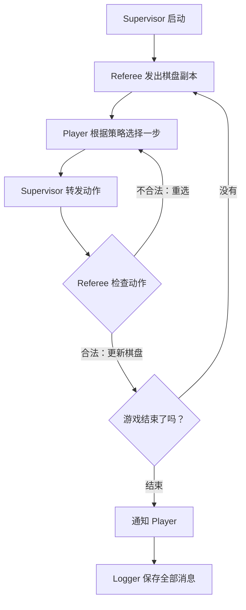

# Multi-Agent Tic-Tac-Toe

这是一个用 Python 写的小型多智能体井字棋项目。棋盘只有 3×3，却足够把多进程通信、角色分工、策略替换、日志记录和边缘设备部署串起来。每个 Agent 都有自己的进程和收件箱，裁判掌握唯一的正式棋盘，消息总线负责传递消息，Logger 负责留下整局过程。
项目目前支持基础启发式、随机、Minimax、Alpha-Beta、MCTS，以及加载预训练权重的 AlphaZero 推理策略。AlphaZero 模块采用只推理接入，不包含训练流程。项目会把模型权重加载到等价的 PyTorch 网络中，实际落子时读取 policy head 的概率，并过滤掉已经占用的位置。如果模型文件缺失或加载失败，Agent 会自动退回 MCTS，程序仍然可以继续完成对局。

## 项目结构

```text
tictactoe/
├── environment.py              # 棋盘、合法动作、胜负判断和文本渲染
├── main.py                     # 基础多智能体版本：启发式 X 对随机 O
├── minmax.py                   # Minimax 版本、测试和可配置策略对战入口
├── strategies.py               # Alpha-Beta、MCTS 和 AlphaZero 策略
├── alphazero_adapter.py        # 预训练 AlphaZero 权重的 PyTorch 推理适配器
└── models/
    └── best-25eps-25sim-10epch.pth.tar
```

一局游戏由四类进程组成：`Referee`、`Player X`、`Player O` 和 `Logger`。Player 只根据收到的棋盘副本提出动作，Referee 检查动作是否合法、更新正式棋盘并决定游戏是否结束。所有消息经过统一的字典结构传递，日志使用 JSON Lines 格式保存，方便后续统计非法动作、动作数量、胜负和通信顺序。

## Agent 策略

| 策略名 | 实现位置 | 特点 | 适合用来做什么 |
| --- | --- | --- | --- |
| `random` | `main.py` | 从合法位置随机选一步 | 作为基线，制造一点不可预测性 |
| `heuristic` | `main.py` | 按立即获胜、立即防守、中心、角落、边的顺序选点 | 轻量基线，速度很快 |
| `minimax` | `minmax.py` | 穷举后续状态，使用胜负分数选择最优动作 | 3×3 棋盘上的确定性强基线 |
| `alpha_beta` | `strategies.py` | Minimax 加 Alpha-Beta 剪枝 | 和 Minimax 结果相近，搜索更利落 |
| `mcts` | `strategies.py` | 使用 UCT 进行随机模拟和树搜索 | 观察搜索预算对决策的影响 |
| `alpha_zero` | `alphazero_adapter.py` | 使用预训练网络输出 policy，再从合法位置中选择概率最高的动作 | 体验模型推理接入和 GPU/边缘设备部署 |

`alpha_zero` 当前接入的是神经网络推理部分，完整的 AlphaZero 自我对弈训练和网络引导树搜索还没有放进这个版本。这样设计让接口简单、启动快，适合先观察一个已有模型如何进入多智能体系统；后续如果要继续研究，再把 policy/value 与树搜索合起来即可。

## Agent 工作流

下面这张图只保留一局棋最重要的几步。X 和 O 都属于 Player，区别只在于它们使用的策略不同。



Supervisor 负责转发消息，Referee 负责棋盘和规则，Player 负责选择动作，Logger 负责记录。这样读一局 JSONL 时，可以按图中的顺序回放比赛。

## Windows x86-64 安装

下面的环境适合 Windows 10/11 和 NVIDIA GPU。当前开发机使用 RTX 4060 Laptop GPU，Python 3.11，PyTorch 2.6.0 CUDA 12.4。项目的规则判断、Minimax、Alpha-Beta 和 MCTS 只依赖 Python 标准库；要运行 AlphaZero 预训练模型，再安装 PyTorch、NumPy 和 h5py。

先确认 Anaconda 或 Miniconda 已经可以在 PowerShell 中使用：

```powershell
conda --version
nvidia-smi
```

创建项目环境并安装 GPU 版 PyTorch：

```powershell
conda create -n tictactoe-gpu python=3.11 -y
conda activate tictactoe-gpu

python -m pip install torch==2.6.0 torchvision==0.21.0 --index-url https://download.pytorch.org/whl/cu124
python -m pip install numpy h5py
```

验证 CUDA 是否真的可用：

```powershell
python -c "import torch; print(torch.__version__); print('CUDA:', torch.cuda.is_available()); print(torch.cuda.get_device_name(0) if torch.cuda.is_available() else 'CPU mode')"
```

如果只想运行规则和经典搜索，也可以使用一个更轻的环境：

```powershell
conda create -n tictactoe python=3.11 -y
conda activate tictactoe
```

## Linux ARM64 安装

Linux ARM64 版本主要面向 Jetson Orin Nano、Jetson Orin NX 等设备。先确认架构和 JetPack 版本：

```bash
uname -m
cat /etc/nv_tegra_release
```

`uname -m` 应该显示 `aarch64`。Jetson 上的 PyTorch 要和 JetPack、Python 版本以及 CUDA 版本匹配，建议先安装 JetPack，再使用 NVIDIA 发布的 Jetson PyTorch wheel。NVIDIA 的安装说明和版本列表见 [Installing PyTorch for Jetson Platform](https://docs.nvidia.com/deeplearning/frameworks/install-pytorch-jetson-platform/index.html)。

先准备系统依赖和一个虚拟环境。`--system-site-packages` 是为了让虚拟环境能够使用 JetPack 已经准备好的系统 CUDA 库：

```bash
sudo apt-get update
sudo apt-get install -y python3-venv python3-pip libopenblas-dev

python3 -m venv .venv --system-site-packages
source .venv/bin/activate
python -m pip install --upgrade pip
python -m pip install numpy h5py
```

接着安装与本机 JetPack 对应的 ARM64 PyTorch。下面是命令格式，`TORCH_INSTALL` 请替换成 NVIDIA 页面上与你的 JetPack 和 Python 版本完全匹配的 wheel 地址：

```bash
# 下面两项只是示例变量，按设备实际版本填写
export TORCH_INSTALL="https://developer.download.nvidia.com/compute/redist/jp/v<JP_VERSION>/pytorch/<TORCH_WHEEL>.whl"
python -m pip install --no-cache-dir "$TORCH_INSTALL"
```

例如 JetPack 6 系列、Python 3.10 的公开 wheel 通常会使用类似下面的文件命名方式；安装前请以 NVIDIA 当前下载页的兼容版本为准：

```bash
# 示例格式：torch-2.x.x-cp310-cp310-linux_aarch64.whl
export TORCH_INSTALL="https://developer.download.nvidia.com/compute/redist/jp/v60/pytorch/torch-2.3.0-cp310-cp310-linux_aarch64.whl"
python3 -m pip install --no-cache-dir "$TORCH_INSTALL"
```

验证 ARM64 GPU 环境：

```bash
python -c "import torch; print(torch.__version__); print('CUDA:', torch.cuda.is_available()); print(torch.cuda.get_device_name(0) if torch.cuda.is_available() else 'CPU mode')"
```

如果设备上的 JetPack 已经自带可用的 `torch`，先通过上面的验证命令检查，确认成功后不必重复安装。普通 PyPI 的 x86 CUDA wheel 不能直接替代 Jetson 的 ARM64 wheel。

## 运行项目

在项目根目录运行基础版本：

```bash
python main.py
```

基础版本会运行规则测试，再启动一局多进程对战，默认由启发式 Player X 对随机 Player O。运行结束后会生成 `messages.jsonl`。

运行 Minimax 版本及其测试：

```bash
python minmax.py
```

这个入口会先测试 Minimax、Alpha-Beta 和 MCTS，然后进行五局完整多智能体对战。`minmax.py` 支持从命令行选择两名 Player 的策略，下面是一局预训练 AlphaZero 推理演示：

```bash
python minmax.py --x-strategy heuristic --o-strategy alpha_zero --games 1
```

也可以比较经典搜索策略：

```bash
python minmax.py --x-strategy alpha_beta --o-strategy mcts --games 5
python minmax.py --x-strategy minimax --o-strategy alpha_beta --games 5
python minmax.py --x-strategy random --o-strategy alpha_zero --games 10
```

每个位置使用 `0` 到 `8` 编号，布局如下：

```text
0 | 1 | 2
--+---+--
3 | 4 | 5
---+---+---
6 | 7 | 8
```

## PyCharm

项目中已经准备了三个运行思路：基础 `main.py`、五局 `minmax.py`，以及带参数的 AlphaZero 推理演示。Windows 下选择 Conda 环境 `tictactoe-gpu` 作为项目解释器即可，PyCharm 会自动使用该环境中的 Python。也可以在 PyCharm 的运行配置里填写：

```text
脚本：minmax.py
参数：--x-strategy heuristic --o-strategy alpha_zero --games 1
工作目录：项目根目录
```

## 日志和测试

Logger 会把消息逐行写入 JSONL 文件，每一行对应一条通信消息。测试重点包括立即获胜、阻止对手获胜、避免必输、动作合法性、游戏结束通知和 Logger 是否收到完整记录。对战产生的 `messages*.jsonl` 属于运行产物，已经在 `.gitignore` 中排除。

模型权重文件较大，当前仓库保留了能直接运行 AlphaZero 演示的 checkpoint。它只用于推理，程序启动时会自动从项目目录加载。

## 致谢与许可

AlphaZero 模块使用的网络结构、权重文件及相关适配遵循 [AlphaZero General](https://github.com/suragnair/alpha-zero-general) 项目的 MIT License。该说明用于保留模型和代码的许可信息。

## 后续可以怎么玩

这个项目的下一步空间很自然：把 3×3 扩展到 4×4 或 5×5，给 Referee 增加统计面板，把每种策略的耗时、访问节点数和胜率写入实验报告，再把 AlphaZero 的 policy/value 接入 MCTS。到那时，棋盘还是方的，实验结果会开始变得很有层次。
